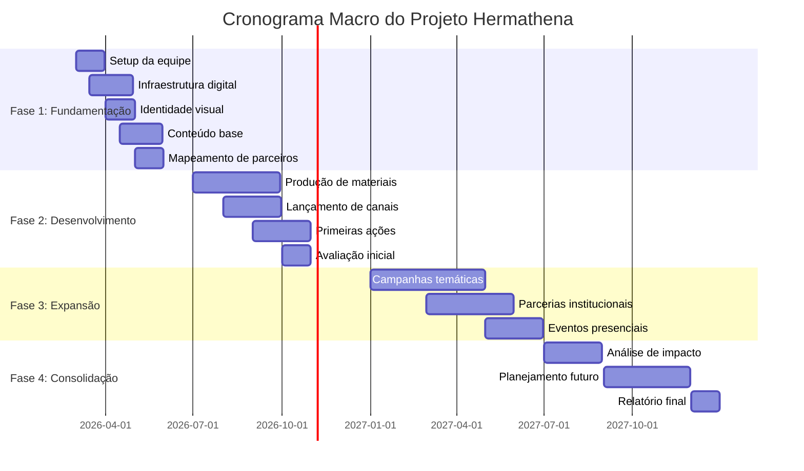

# Cronograma

```mermaid
gantt
title Cronograma Macro do Projeto Hermathena
dateFormat YYYY-MM-DD

section Fase 1: Fundamentação
Setup da equipe :2026-03-01, 30d
Infraestrutura digital :2026-03-15, 45d
Identidade visual :2026-04-01, 30d
Conteúdo base :2026-04-15, 45d
Mapeamento de parceiros :2026-05-01, 30d

section Fase 2: Desenvolvimento
Produção de materiais :2026-07-01, 90d
Lançamento de canais :2026-08-01, 60d
Primeiras ações :2026-09-01, 60d
Avaliação inicial :2026-10-01, 30d

section Fase 3: Expansão
Campanhas temáticas :2027-01-01, 120d
Parcerias institucionais :2027-03-01, 90d
Eventos presenciais :2027-05-01, 60d

section Fase 4: Consolidação
Análise de impacto :2027-07-01, 60d
Planejamento futuro :2027-09-01, 90d
Relatório final :2027-12-01, 30d
```
