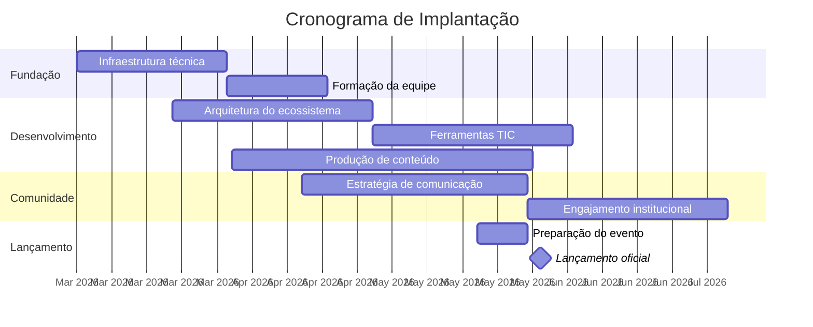

# Cronograma do Projeto

```mermaid
gantt
title Cronograma de Implantação
dateFormat  YYYY-MM-DD
axisFormat  %b %Y

section Fundação
Infraestrutura técnica        :infra, 2026-03-01, 30d
Formação da equipe            :team,  after infra, 20d

section Desenvolvimento
Arquitetura do ecossistema    :arch, 2026-03-20, 40d
Ferramentas TIC               :tools, after arch, 40d
Produção de conteúdo          :content, 2026-04-01, 60d

section Comunidade
Estratégia de comunicação     :comm, 2026-04-15, 45d
Engajamento institucional     :engage, after comm, 40d

section Lançamento
Preparação do evento          :prep, 2026-05-20, 10d
Lançamento oficial            :milestone, 2026-06-01, 1d
```

